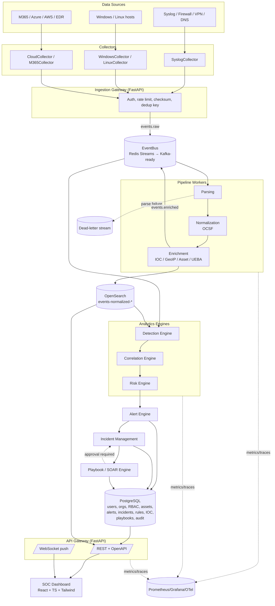

# LUNATIC-IT SIEM — Architecture (Phase 0)

Status: **draft for validation**. No implementation exists yet. This document
covers spec analysis, the target architecture, the component diagram, service
interfaces, and the final repository layout. See also `THREAT_MODEL.md`,
`docs/database/postgresql_schema.sql`, `docs/database/opensearch_indices.md`,
`docs/TECHNICAL_RISKS.md`, and `docs/DEVELOPMENT_PLAN.md`.

## Table of contents

1. [Spec analysis & inconsistencies](#1-spec-analysis--inconsistencies)
2. [Final architecture](#2-final-architecture)
3. [Deployment topology](#3-deployment-topology)
4. [Component diagram](#4-component-diagram)
5. [Data flow (event lifecycle)](#5-data-flow-event-lifecycle)
6. [Bounded contexts / modules](#6-bounded-contexts--modules)
7. [Service interfaces](#7-service-interfaces)
8. [Final repository layout](#8-final-repository-layout)
9. [Key architectural decisions (ADR summary)](#9-key-architectural-decisions-adr-summary)

---

## 1. Spec analysis & inconsistencies

The specification is thorough but written as a wishlist of a mature product.
Read literally it would imply distributed streaming (Kafka), a full
UEBA/ML stack, a general-purpose SOAR, and 1M+ events/minute — all on
"Phase 1". The following inconsistencies/gaps must be resolved before coding
starts, and the resolution is baked into the architecture below:

| # | Inconsistency / gap in the spec | Resolution adopted |
|---|---|---|
| 1 | Kafka is "for later" but throughput targets (1M events/min) effectively require a durable, replayable log from day one. | Introduce an `EventBus` **abstraction** (Protocol) from Phase 1 with a Redis Streams implementation now and a Kafka implementation later behind the same interface. No business code talks to Redis or Kafka directly. |
| 2 | Two systems of record (PostgreSQL for entities, OpenSearch for events) with no described consistency strategy. | PostgreSQL is the **source of truth for state** (alerts, incidents, rules, IOCs, users). OpenSearch is the **source of truth for raw/normalized events only** and is treated as a rebuildable index (events are replayable from the DLQ/archive). Alerts/incidents reference OpenSearch `event_id`s by value, never by join. |
| 3 | Multi-tenancy is stated as a requirement but no isolation mechanism is specified — app-level filtering alone is a well-known IDOR source. | Defense in depth: PostgreSQL Row-Level Security (RLS) policies keyed on `tenant_id` **and** OpenSearch Document-Level Security (DLS) via the OpenSearch Security plugin, **in addition to** application-level filtering. A forgotten `WHERE tenant_id = ...` must not be sufficient to leak data. |
| 4 | Detection rules mix stateless (single-event) and stateful (windowed, `group_by`, `threshold`) semantics under one YAML shape without separating execution models. | Detection Engine has two execution paths sharing one rule schema: a **streaming evaluator** for single-event rules and a **windowed aggregator** (scheduled OpenSearch aggregation queries against a bucketed time index) for threshold/window rules. Both compile from the same YAML DSL. |
| 5 | "Never silently lose an event" is a hard requirement, but no persistent queue exists before Kafka. | Redis Streams consumer groups (with `XPENDING`/`XCLAIM` for redelivery) act as the DLQ backbone pre-Kafka; every stage acknowledges explicitly; unacked/failed messages age into a `dlq` stream, never dropped. |
| 6 | OCSF is prescribed as "the" normalization model but the spec also lists a bespoke flat field set (`source_ip`, `process`, `cloud`, …) that only partially matches OCSF class fields, and no OCSF version is pinned. | Pin **OCSF 1.1.0**. Store the OCSF-mapped event as `normalized_event` (JSON, schema-versioned) and keep the flat fields the spec lists as **derived, indexed projections** for fast search/filter, computed from the OCSF object — not a second independent schema. |
| 7 | RBAC lists 10 roles but no permission matrix; "never trust the frontend" is stated but nothing defines the source of truth for permissions. | Explicit `permissions` table + `role_permissions` mapping in PostgreSQL, enforced via a FastAPI dependency on every route (`require_permission("incident:write")`). Frontend renders based on a `/me/permissions` response but the API independently re-checks on every call. |
| 8 | Destructive SOAR actions ("disable user", "isolate host") are marked optional/approval-required but no approval workflow entity is defined. | Explicit `playbook_action_approvals` state machine (`PENDING_APPROVAL → APPROVED/REJECTED → EXECUTED`) with dual control (requester ≠ approver), dry-run mode, and mandatory audit log entry at every transition. |
| 9 | Performance targets (1k / 100k / 1M events/min) are stated as goals but section 24 also says "never claim a load without a benchmark." | Targets are labeled explicitly as **goals**, not guarantees. Phase 18 (Performance testing) is the only phase allowed to publish a supported-throughput number, backed by a checked-in load-test report. |
| 10 | UEBA and Risk Engine both want to influence severity, and MITRE + Threat Intel + Asset Criticality all feed the Risk Engine, but no explicit formula/weights are given. | Risk Engine (Phase 8) defines a versioned, explainable weighted-sum formula (see `docs/DEVELOPMENT_PLAN.md`) with each factor capped and logged so `risk_score_explanation` can always be reconstructed per alert. |
| 11 | Syslog UDP is listed as a required collector; UDP is unauthenticated and spoofable, conflicting with "hardening" requirements. | Accepted as a known-risk legacy input, network-isolated (dedicated ingress, source-IP allowlist, rate limiting), documented in `THREAT_MODEL.md`; TLS syslog is the recommended production path. |
| 12 | "Modular and decoupled" plus "must evolve toward a distributed architecture" without prescribing a starting deployment shape. | **Modular monolith** for the API (one FastAPI codebase, hard module boundaries, no cross-module DB access — see §6) + **separately deployable async workers** for the pipeline (ingestion, parsing, enrichment, detection, correlation). This gets decoupling and independent scaling for the hot path now, without premature microservice overhead, and each module can be extracted to its own service later because it already only talks to others via the defined interfaces (§7). |

---

## 2. Final architecture

```
DATA SOURCES
   │  (syslog UDP/TCP/TLS, REST, JSON/CSV files, WEL, AD, M365, Azure, AWS, EDR)
   ▼
COLLECTORS                (standalone processes, one per source family)
   ▼  raw bytes + collector metadata
INGESTION GATEWAY         (FastAPI service: auth, rate-limit, checksum, push to bus)
   ▼  events.raw  (EventBus / Redis Streams topic)
PARSING WORKERS           (format detection → field extraction; failure → DLQ)
   ▼  events.parsed
NORMALIZATION             (OCSF mapping, schema validation)
   ▼  events.normalized
ENRICHMENT WORKERS        (GeoIP, IOC lookup, asset context, user context, UEBA baseline)
   ▼  events.enriched  ──────────────► OPENSEARCH (events-normalized-*, hot-warm-delete ILM)
   ▼
DETECTION ENGINE          (streaming rules + windowed aggregation rules)
   ▼  detections
CORRELATION ENGINE        (multi-event sequences → timeline)
   ▼  correlated findings
RISK ENGINE                (explainable weighted score, 0–100)
   ▼
ALERT ENGINE               (dedup, suppression, status lifecycle)  ──► POSTGRESQL (alerts)
   ▼
INCIDENT MANAGEMENT         (alert→incident promotion, workflow)   ──► POSTGRESQL (incidents)
   ▼
SOAR / PLAYBOOK ENGINE       (enrich, notify, contain — approval-gated)
   ▼
SOC DASHBOARD (React/TS/Tailwind)  ◄── REST/OpenAPI + WebSocket ── API GATEWAY (FastAPI)
```

Cross-cutting, present at every stage: **structured logging, OpenTelemetry
tracing, Prometheus metrics, audit logging, multi-tenant context
propagation (`tenant_id` carried on every message), idempotency keys.**

## 3. Deployment topology

- **Phase 1–17 (single-region, HA-ready):** Docker Compose for dev; the same
  images run on Kubernetes from Phase 19 with no code change (12-factor: config
  via env/secrets, no local disk state in the app tier).
- **Stateless tiers** (API, workers) scale horizontally behind a load balancer /
  Kubernetes `Service`; **stateful tiers** (PostgreSQL, OpenSearch, Redis) run
  as clustered/replicated services (see `docs/TECHNICAL_RISKS.md` for HA
  specifics per store).
- **Workers** are separate deployables from the API from day one
  (`backend/app/workers/`), each subscribed to one EventBus topic, so the
  ingestion hot path never shares a process — or a failure domain — with the
  request/response API.

## 4. Component diagram



## 5. Data flow (event lifecycle)

1. **Collect** — a collector reads from its source, wraps the raw payload with
   `collector_id`, `source_type`, `received_at`, and a content hash.
2. **Ingest** — the Ingestion Gateway authenticates the collector (mTLS or API
   key), rate-limits per tenant, computes an idempotency key
   (`sha256(tenant_id + source + raw_hash)`) to dedupe retried sends, and
   publishes to `events.raw`.
3. **Parse** — a worker pool detects format (JSON/Syslog/CEF/LEEF/WEL/Apache/
   Nginx/firewall/auth) and extracts fields. Failure → full raw event +
   failure reason go to `events.deadletter`; a Prometheus counter increments;
   nothing is dropped.
4. **Normalize** — parsed fields map into the pinned OCSF 1.1.0 classes;
   `raw_event` is always retained verbatim for forensics; the record gets a
   `schema_version`.
5. **Enrich** — IOC matches, GeoIP, asset criticality, user risk baseline,
   and MITRE hints are attached. Enrichment failures degrade gracefully
   (event proceeds unenriched, flagged `enrichment_partial=true`) — enrichment
   must never block ingestion.
6. **Index** — the enriched event is written to OpenSearch
   (`events-normalized-*`) and the event is published on `events.enriched`.
7. **Detect** — streaming rules evaluate the single event immediately;
   windowed rules are evaluated by a scheduler running OpenSearch aggregation
   queries per rule's `window`/`group_by`.
8. **Correlate** — the Correlation Engine looks for the multi-event sequences
   its rules define within their time windows and builds a timeline.
9. **Score** — the Risk Engine computes an explainable 0–100 score from
   severity, confidence, asset criticality, user risk, threat intel,
   MITRE context, and behavioral anomaly.
10. **Alert** — the Alert Engine dedupes/suppresses and creates/updates an
    `alerts` row in PostgreSQL with full evidence and lineage back to the
    OpenSearch `event_id`s.
11. **Investigate / Respond** — analysts triage in the dashboard, promote to
    an incident, run playbooks (approval-gated for destructive actions), and
    every action is audit-logged.

## 6. Bounded contexts / modules

Each module below owns its own PostgreSQL tables and is the *only* code
allowed to write to them (no cross-module raw SQL). Cross-module reads go
through the module's service interface (in-process call now, RPC-ready
later).

| Module | Owns | Depends on |
|---|---|---|
| `identity` | users, orgs/tenants, roles, permissions, sessions, API keys | — |
| `assets` | assets, asset ownership/criticality | `identity` |
| `ingestion` | collector registry, ingestion tokens | `identity` |
| `parsing` / `normalization` | parser registry, schema versions | `ingestion` |
| `enrichment` | enrichment source configs | `threat_intel`, `assets`, `identity` |
| `detection` | detection rules, rule versions, dry-run results | `mitre` |
| `correlation` | correlation rules, timelines | `detection` |
| `risk` | risk formula config, score explanations | `threat_intel`, `assets`, `identity` |
| `alerting` | alerts | `risk`, `detection`, `correlation` |
| `incidents` | incidents, tasks, notes, timeline, evidence | `alerting`, `assets`, `identity` |
| `threat_intel` | IOCs, feeds, IOC history | — |
| `mitre` | tactics, techniques, sub-techniques, coverage | — |
| `hunting` | saved queries/hunts | OpenSearch (read-only) |
| `playbooks` | playbooks, runs, approvals | `incidents`, `alerting` |
| `audit` | audit_logs (append-only) | all modules (write-only fan-in) |
| `reporting` | report definitions/exports | read access across modules |

## 7. Service interfaces

### 7.1 EventBus (internal, in-process contract today)

```python
class EventBusMessage(Protocol):
    tenant_id: str
    key: str            # partitioning / idempotency key
    payload: bytes
    headers: dict[str, str]

class EventBus(Protocol):
    async def publish(self, topic: str, message: EventBusMessage) -> None: ...
    async def subscribe(self, topic: str, group: str) -> AsyncIterator[EventBusMessage]: ...
    async def ack(self, topic: str, group: str, message_id: str) -> None: ...
    async def dead_letter(self, topic: str, message: EventBusMessage, reason: str) -> None: ...
```

`RedisStreamsEventBus` implements this now (`XADD`/`XREADGROUP`/`XACK`/
`XCLAIM`); a future `KafkaEventBus` implements the same `Protocol` with zero
changes to callers. Topics: `events.raw`, `events.parsed`, `events.normalized`,
`events.enriched`, `events.deadletter`, `detections.created`,
`alerts.created`, `incidents.updated`, `playbooks.requested`.

### 7.2 Detection rule contract (YAML → compiled rule)

Two execution shapes share one schema (`rule_id`, `conditions`, `group_by`,
`window`, `mitre_attack`, `risk_score`, `actions`, `status`, `version`):
absence of `window`/`group_by` compiles to a **streaming** evaluator; their
presence compiles to a **windowed aggregation** evaluator scheduled against
OpenSearch. Both expose the same `evaluate(event_or_bucket) -> RuleMatch |
None` interface to the Detection Engine.

### 7.3 REST API (external contract)

OpenAPI-documented FastAPI app; JWT (OIDC-compatible) bearer auth; every
route wrapped by `require_permission(<resource>:<action>)` and
`require_tenant_scope()`. Base resource groups match §22 of the spec:
`/auth`, `/users`, `/organizations`, `/assets`, `/events`, `/alerts`,
`/incidents`, `/iocs`, `/rules`, `/detections`, `/hunting`, `/mitre`,
`/playbooks`, `/audit`, `/metrics`, `/health`. Full schemas are produced in
Phase 3+ per resource, not upfront, to avoid speculative contracts.

### 7.4 Enrichment provider contract

```python
class EnrichmentProvider(Protocol):
    name: str
    async def enrich(self, event: NormalizedEvent) -> EnrichmentResult: ...
```

Providers (GeoIP, IOC match, asset lookup, user risk) are registered in a
pipeline; each is time-boxed and failure-isolated (a slow/broken provider
degrades that field only, never blocks the event).

### 7.5 Playbook action contract

```python
class PlaybookAction(Protocol):
    name: str
    destructive: bool
    async def dry_run(self, context: PlaybookContext) -> ActionPreview: ...
    async def execute(self, context: PlaybookContext) -> ActionResult: ...
```

`destructive=True` actions are routed through the approval state machine
regardless of caller; `execute()` is unreachable without an `APPROVED`
approval record when `destructive=True`.

## 8. Final repository layout

```
lunatic-siem/
├── backend/
│   └── app/
│       ├── api/                # FastAPI routers per resource group
│       ├── auth/                # JWT/OIDC, session, MFA
│       ├── core/                 # config, logging, tracing, exceptions, EventBus abstraction
│       ├── models/                # SQLAlchemy ORM models, per module
│       ├── schemas/                # Pydantic request/response schemas
│       ├── services/                # business logic per bounded context (§6)
│       ├── collectors/                # SyslogCollector, WindowsCollector, ...
│       ├── parsers/                     # JSON/CEF/LEEF/Syslog/WEL/Apache/Nginx parsers
│       ├── normalization/                # OCSF mapping
│       ├── enrichment/                    # enrichment providers
│       ├── detection/                      # rule DSL, streaming + windowed evaluators
│       ├── correlation/                     # correlation rule engine, timeline builder
│       ├── risk/                             # risk scoring engine
│       ├── threat_intel/                      # IOC management, feed connectors
│       ├── mitre/                              # ATT&CK import/mapping/coverage
│       ├── incidents/                           # incident workflow
│       ├── hunting/                              # search/pivot API over OpenSearch
│       ├── playbooks/                             # SOAR engine, approvals
│       ├── audit/                                  # append-only audit log writer
│       ├── workers/                                 # deployable pipeline workers (ingestion→enrichment, detection, correlation)
│       └── tests/                                    # unit/integration tests mirroring the tree above
├── frontend/
│   └── src/
│       ├── components/
│       ├── pages/
│       ├── features/
│       ├── services/
│       ├── hooks/
│       └── types/
├── rules/
│   ├── authentication/
│   ├── windows/
│   ├── linux/
│   ├── network/
│   ├── cloud/
│   ├── email/
│   └── data_security/
├── collectors/            # standalone collector binaries/configs not embedded in backend/
├── parsers/                 # shared parser grammars/fixtures used by backend/app/parsers
├── docker/
├── kubernetes/
├── docs/
├── scripts/
├── tests/                      # cross-cutting e2e/load/security test suites
└── .github/
```

Documentation lives at the repository root as listed in the spec (README,
ARCHITECTURE, SECURITY, API, DEPLOYMENT, DEVELOPMENT, DETECTION_ENGINE,
THREAT_HUNTING, INCIDENT_RESPONSE, MITRE_MAPPING, CONTRIBUTING) plus a
`docs/` folder for deeper/derived material (database schema, index
mappings, development plan, risk register) that would otherwise bloat the
root.

## 9. Key architectural decisions (ADR summary)

| Decision | Alternative considered | Why this one |
|---|---|---|
| Modular monolith API + separate pipeline workers | Microservices per bounded context from day one | Avoids premature network overhead/ops burden; module boundaries already enforce the seams needed to split later. |
| Redis Streams now, Kafka-ready abstraction | Kafka from day one | Kafka ops overhead isn't justified before Phase 18 load testing proves it's needed; the `EventBus` Protocol makes the swap mechanical. |
| PostgreSQL RLS + OpenSearch DLS for tenant isolation | Application-layer filtering only | Defense in depth against IDOR; matches the spec's explicit cross-tenant test requirement (§20). |
| OCSF 1.1.0 pinned, flat fields as derived projections | Bespoke flat schema as primary | Keeps forensic fidelity and interoperability with OCSF-aware tooling while still giving fast flat-field search. |
| Explainable weighted-sum Risk Engine | Black-box ML risk model | Spec requires the analyst to see *why* a score was computed (§10); ML scoring can be added later as one more weighted factor. |
| Explicit approval state machine for destructive SOAR actions | Role-gated "confirm" button only | Spec mandates dual control + audit for destructive actions (§18); a state machine makes "no approval → no execution" enforceable in code, not just UI. |
