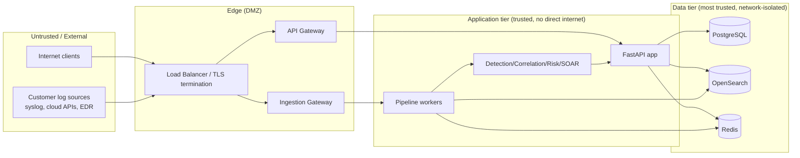

# LUNATIC-IT SIEM — Threat Model (Phase 0)

Status: **draft for validation**. Methodology: STRIDE per trust boundary,
plus a dedicated section for SIEM-specific abuse cases (a SIEM is itself a
high-value target: whoever controls the SIEM controls what the SOC can see).

## 1. Trust boundaries

Boundary crossings requiring explicit controls:
1. **Internet ↔ Edge** — TLS everywhere, WAF-style rate limiting, no direct
   internet exposure of PostgreSQL/OpenSearch/Redis ports.
2. **Log sources ↔ Ingestion Gateway** — the highest-volume, least-trusted
   input; treated as hostile by default (see §3.1).
3. **Edge ↔ Application tier** — internal auth (service tokens / mTLS),
   never re-trusts a client-asserted `tenant_id` without re-deriving it from
   the authenticated session/API key.
4. **Application tier ↔ Data tier** — least-privilege DB roles per module,
   network policy restricting data-tier access to the app tier only.

## 2. Assets to protect (ranked)

1. **Tenant isolation** — cross-tenant data exposure is the single worst
   outcome for a multi-tenant SOC platform.
2. **Audit log integrity** — if audit logs can be forged/deleted, incident
   response and compliance value collapses.
3. **Detection rule integrity** — a modified/disabled rule is a silent way
   to blind the SOC.
4. **Credentials & secrets** (DB, OpenSearch, JWT signing keys, IOC feed
   API keys, SOAR integration credentials).
5. **Raw event data** (forensic evidence — may contain PII/secrets from
   customer environments; retention and access must be controlled).
6. **Playbook execution channel** — an attacker who can trigger playbook
   actions can pivot the SIEM into an attack tool against the customer's own
   estate (e.g., forcing "isolate host" or "disable user" on a legitimate
   target).

## 3. STRIDE analysis

### 3.1 Collectors & Ingestion Gateway

| Threat | STRIDE | Mitigation |
|---|---|---|
| Spoofed syslog UDP source claiming to be a trusted host | Spoofing | UDP syslog restricted to allow-listed source IPs per tenant; documented as legacy/best-effort; TLS syslog recommended for anything sensitive. |
| Forged ingestion API key / replayed request | Spoofing, Tampering | Per-collector credentials (API key or mTLS client cert), request signing/idempotency key, short-lived tokens where possible. |
| Oversized/malformed payload crashing a parser | DoS | Strict payload size caps, per-tenant rate limiting, parser sandboxing (never `eval`/dynamic code on untrusted input), malformed input → DLQ not a crash. |
| Flood of ingestion traffic from one tenant starving others | DoS | Per-tenant token-bucket rate limiting at the Ingestion Gateway before the EventBus. |
| Log injection (attacker crafts a log line to be mis-parsed as a different event type/severity to hide an attack) | Tampering | Parsers validate structurally (schema, not regex-only); raw event always retained so normalized fields can be audited against source. |
| Silent event loss under backpressure | Repudiation (of the event itself) | EventBus ack/dead-letter semantics (§7.1 of ARCHITECTURE.md); `events_dropped_total` alarms on any non-zero value. |

### 3.2 Multi-tenancy / IDOR

| Threat | STRIDE | Mitigation |
|---|---|---|
| Analyst from Tenant A reads Tenant B's alerts/incidents/events via a forgotten `tenant_id` filter | Information Disclosure | PostgreSQL RLS policies + OpenSearch Document-Level Security as a second, independent enforcement layer (see ARCHITECTURE.md §1 row 3); dedicated cross-tenant automated tests (§20 of spec) run in CI, failure = build fails. |
| IDOR via sequential/guessable IDs (`/incidents/1235`) | Information Disclosure, Elevation of Privilege | UUIDs for all externally referenced entities; authorization check is by (tenant, permission), never by "ID looks valid". |
| Tenant ID spoofed in a request body/header | Elevation of Privilege | `tenant_id` is always derived server-side from the authenticated principal, never accepted from client input on write paths. |

### 3.3 AuthN/AuthZ

| Threat | STRIDE | Mitigation |
|---|---|---|
| Credential stuffing / brute force against login | Spoofing | Argon2id hashing, progressive lockout/rate limiting, MFA, breached-password checks. |
| JWT tampering / algorithm confusion (`alg=none`) | Tampering, Spoofing | Fixed allowed algorithm list server-side, signature verification library (never hand-rolled), short-lived access tokens + rotating refresh tokens, `kid`-scoped key lookup. |
| Privilege escalation via role/permission tampering in request | Elevation of Privilege | Roles/permissions resolved server-side from the DB per request; RBAC dependency on every route; deny-by-default. |
| Session fixation / replay of stolen token | Spoofing | Token rotation on privilege-sensitive actions, session binding (IP/device fingerprint as a signal, not a hard block), short expirations. |
| Frontend-only permission checks bypassed via direct API calls | Elevation of Privilege | Every route independently enforces RBAC server-side (spec §19 — "never trust the frontend alone"). |

### 3.4 Detection / Correlation / Risk / Alerting

| Threat | STRIDE | Mitigation |
|---|---|---|
| Analyst (malicious insider or compromised account) silently disables/weakens a detection rule to blind the SOC | Repudiation, Tampering | Rule changes are versioned and audit-logged (before/after diff), require `SOC_MANAGER`+ permission, and rule-disable events themselves can generate a meta-alert. |
| Alert flooding to bury a real alert (alert fatigue as an attack) | DoS (on analyst attention) | Suppression/dedup logic, rate-aware correlation, Detection Quality Score tracking false-positive rate over time (§37). |
| Manipulating source timestamps to evade a time-window correlation rule | Tampering | Correlation/detection windows use `ingestion_timestamp` as an anti-evasion backstop in addition to `event.timestamp`; large skew is itself a detectable anomaly. |
| Risk score manipulation via crafted asset/user metadata | Tampering | Risk factor inputs (asset criticality, user risk) are permission-gated writes, audit-logged, and the score explanation always shows which inputs were used. |

### 3.5 Threat Intelligence / IOC

| Threat | STRIDE | Mitigation |
|---|---|---|
| Poisoned/compromised external feed marks a legitimate resource as malicious (false positive at scale) or a malicious one as safe | Tampering | Per spec §11: an IOC is never auto-classified as malicious solely because a feed said so — confidence/source/expiration are tracked and surfaced; feed connectors are pluggable and independently disableable. |
| Stale IOC causing a permanently-blocked legitimate entity | (Availability impact) | Mandatory `expiration`, periodic re-validation job, audit trail of IOC lifecycle changes. |

### 3.6 SOAR / Playbooks

| Threat | STRIDE | Mitigation |
|---|---|---|
| Automated destructive action (disable user, isolate host) triggered by a false positive or by an attacker who can create alerts | Elevation of Privilege, DoS (self-inflicted) | Destructive actions require the approval state machine (dual control, requester ≠ approver), dry-run preview, and are impossible to reach without an `APPROVED` record (ARCHITECTURE.md §7.5). |
| Playbook webhook/action credentials leaked → used to pivot into customer infrastructure | Information Disclosure, Elevation of Privilege | Secrets stored in a secrets manager (never in DB plaintext/config files), scoped least-privilege credentials per integration, egress allow-listing for outbound playbook calls (SSRF mitigation, see §3.8). |

### 3.7 Audit Log

| Threat | STRIDE | Mitigation |
|---|---|---|
| Admin or compromised backend account deletes/edits audit log rows to cover tracks | Repudiation | Audit log table is append-only at the DB privilege level (application DB role has `INSERT` only, no `UPDATE`/`DELETE`); consider write-once export to a separate/immutable store (WORM/object lock) as a hardening follow-up. |
| Audit log itself leaking sensitive data (e.g., full request bodies with secrets) | Information Disclosure | Field-level redaction rules for known-sensitive fields before persisting `before`/`after` snapshots. |

### 3.8 Application-layer (OWASP)

| Threat | STRIDE | Mitigation |
|---|---|---|
| SQL injection | Tampering | SQLAlchemy parameterized queries only; no raw string SQL concatenation; CI security tests assert this. |
| SSRF via playbook "webhook" action or enrichment provider fetching attacker-controlled URLs | Information Disclosure, Elevation of Privilege | Outbound HTTP from playbooks/enrichment goes through an egress allow-list + DNS-rebinding-safe resolver; no fetching of internal/link-local ranges. |
| XSS in the SOC dashboard (e.g., a malicious `command_line` or `hostname` value rendered unescaped) | Tampering (of the analyst's session) | React's default escaping preserved (no `dangerouslySetInnerHTML` on event-derived content); CSP headers. |
| CSRF on state-changing endpoints | Tampering | SameSite cookies where cookies are used at all; primary auth is bearer JWT (not cookie-based) which is inherently CSRF-resistant, but any cookie-based session path gets CSRF tokens. |
| Path traversal in file-based collectors (CSV/JSON ingestion) or export features | Information Disclosure | Strict allow-listed ingestion directories, filename sanitization, no user-controlled path segments. |
| Rate-limit bypass (header spoofing, distributed sources) | DoS | Rate limiting keyed on authenticated principal/tenant, not client-supplied headers; Redis-backed shared counters across instances. |

## 4. Abuse cases specific to a SIEM

- **"Turning off the alarm":** any action that reduces detection coverage
  (disabling a rule, deleting IOCs, lowering a threshold) is treated as a
  sensitive action requiring elevated permission + audit + optional
  meta-detection.
- **"SIEM as a weapon":** the SOAR engine must not become a way to actuate
  destructive changes in the customer's environment without human approval —
  this is why approval is architecturally enforced (§3.6), not just a policy.
- **"Evidence tampering":** raw events, once ingested, are immutable; any
  correction/enrichment is additive (new fields), never a rewrite of
  `raw_event`.
- **"Cross-tenant pivot via shared infrastructure":** shared OpenSearch/Redis
  used by all tenants means a bug in one query path can leak across tenants;
  mitigated by DLS/RLS defense-in-depth (§3.2) plus dedicated automated
  cross-tenant tests gating every release.

## 5. Residual risks accepted at Phase 0 (to revisit)

- Syslog UDP remains inherently spoofable; accepted for legacy compatibility
  under network controls, not eliminated.
- Redis Streams (pre-Kafka) has weaker multi-datacenter durability guarantees
  than a proper log; acceptable until Phase 18/19 proves the need for Kafka.
- No hardware security module (HSM) for JWT signing keys at this stage;
  keys managed via the secrets manager with rotation, HSM is a future
  hardening item for regulated deployments.
